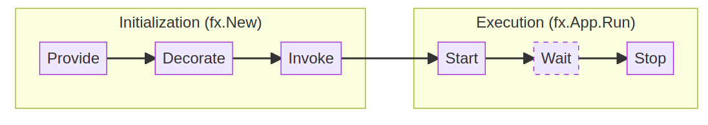

# About project

Hi, I'm Computer Engineer and a few months ago I had to do a proof of concept (PoC) of Dependency Injection in Golang.
You're probably  thinking now that using DY in a language like golang is a risky move, but I believe that it is simply another "tool" that utilizes reflection in background, much like many others. It provides us the ability to decouple our code into componentes, making it easier to integrate new features and maintain a cleaner code.  

While searching  for a Dependency Injection framework or something similar, I came across Uber Fx, and that's when I began working on this CRUD project.

# Technologies involved

In this poc I used the following technologies

• Gorm orm

• Gin-gonic Framework

• Docker compose

• Mysql database

# FX-Example 

In [FX](https://uber-go.github.io/fx/) there are four main concepts:

* `fx.Provide`  Registers all constructors
* `fx.Decorate` Registers all decorators 
* `fx.Invoke`   For function in your modules that must always run  
* `fx.Run`      Executes the app and runs all startup hooks appended to it.

One big benefit of fx are the hooks to startup and shutdown the server. You only have to define the functions to run and stop the server, and you forget about working with channels and signals.

### Running the POC
To start up, there is a docker-compose.yaml that will create a mysql database. Finally, you can run the project with the command `go run .`